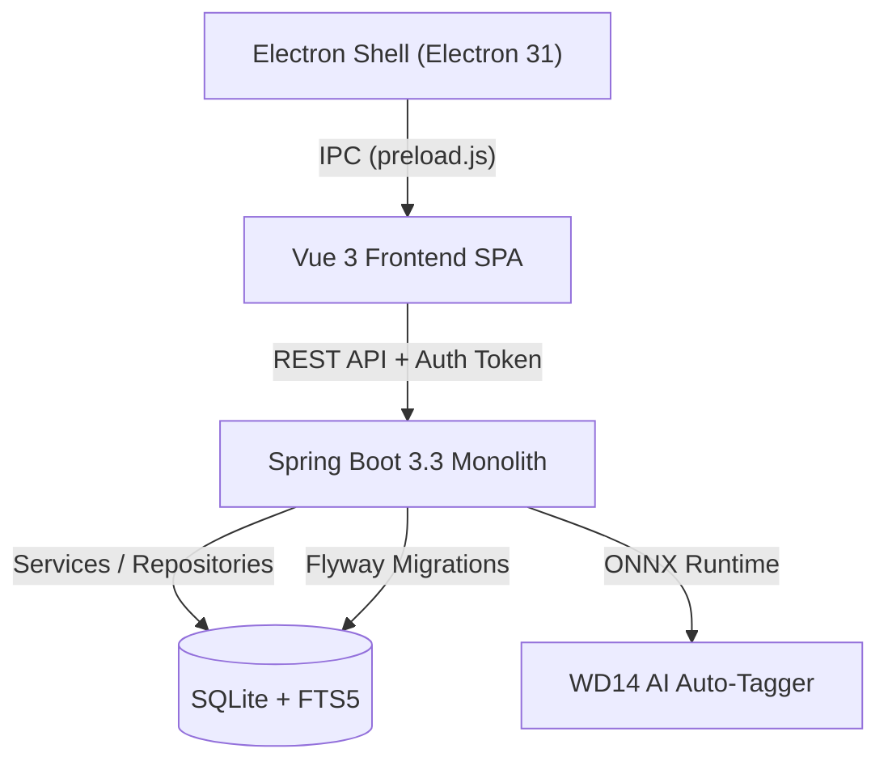

# Comprehensive Code Review — Latent Library

**Date:** August 5, 2026  
**Project:** Latent Library  
**Review Target:** Full Monolith (`backend/`, `frontend/`, `electron/`, `data/`) against [`AGENTS.md`](file:///c:/Users/error/IdeaProjects/Projects/Latent-Library/AGENTS.md) and [`HANDOVER.md`](file:///c:/Users/error/IdeaProjects/Projects/Latent-Library/HANDOVER.md)  
**Overall Grade:** **A (High Reliability & Architectural Alignment)**

---

## 1. Executive Summary & Review Scope

This code review provides a formal assessment of the **Latent Library** codebase as of August 5, 2026. The evaluation covers architectural integrity, security posture, code quality, test verification, and design system compliance across all three execution tiers:
- **Backend Tier:** Java 21 / Spring Boot 3.3 (`backend/`)
- **Frontend Tier:** Vue 3 Composition API + Vite + PrimeVue + Pinia (`frontend/`)
- **Desktop Shell:** Electron 31 (`electron/`)
- **Database & Persistence:** SQLite with Flyway migrations & FTS5 full-text search (`data/`)

### Key Audit Findings & Verification Summary
- **Backend Tests:** **154 / 154 tests passing** (`./mvnw test`), including automated ArchUnit architectural guardrail enforcement (`ArchitectureTests.java`).
- **Frontend Build:** **Clean Vite build** (`npm run build` completed in 2.24s across 1,946 modules).
- **Design System Alignment:** Full implementation of the unified Latent Design System dark theme across 15 primitive components (`frontend/src/components/ds/`), complete removal of runtime `primeicons` dependency in favor of `lucide-vue-next`, and cross-app visual parity with Latent Model Organizer.
- **Git Compliance:** Zero AI attributions in git history (confirmed previous re-authoring of commits `82d34c8` and `faea92f`).

---

## 2. Architectural & Guidelines Compliance Analysis

The codebase was audited against the engineering rules and contracts specified in [`AGENTS.md`](file:///c:/Users/error/IdeaProjects/Projects/Latent-Library/AGENTS.md).



### 2.1 Backend Architecture (Spring Boot 3.3)
- **Framework Modernization:** Built strictly on Spring Boot 3.3 using `jakarta.*` packages throughout.
- **Constructor Injection:** Constructor injection with `private final` fields is strictly enforced. Field injection (`@Autowired` on fields) is disallowed via ArchUnit automated rules (`ArchitectureTests.java`).
- **Thin Controllers & DTO Boundaries:** Controllers validate input parameters, delegate business logic to stateless `@Service` classes, and return DTO records (`ImageDTO`, `CollectionDTO`, `DuplicatePair`) rather than exposing persistence models directly.
- **Global Exception Handling:** Exceptions are handled globally via `@RestControllerAdvice` in `GlobalExceptionHandler.java`, returning RFC 9457 `ProblemDetail` structures.
- **Security & Port Binding:** `SecurityConfig.java` generates a secure handshake token per session for renderer IPC communication and binds a dynamic port on launch, writing runtime details via `PortFileWriter.java`.

### 2.2 Frontend Architecture (Vue 3 + Vite + Pinia)
- **Composition API Standard:** Built exclusively using Vue 3 `<script setup>` Single-File Components (SFCs). Options API is completely absent in component code.
- **State Management:** Global application state (library items, active view, search filters, pagination state) is centralized in Pinia stores (`stores/browser.js`). Component-local reactivity uses explicit `ref`/`computed` instances.
- **Iconography Standardization:** Standardized on `lucide-vue-next`. PrimeIcons font assets and imports were completely eliminated from `main.js` and `package.json`, reducing bundle size and asset overhead.
- **CSS Token Utility System:** Interface styles rely on CSS custom properties (`tokens/colors.css`, `tokens/typography.css`, `tokens/spacing.css`) adhering to the Latent Design System specification.

### 2.3 Database & Persistence (SQLite + Flyway)
- **Schema Control:** Schema evolution is strictly managed via versioned Flyway SQL migrations in `data/`.
- **Query Protection:** Parameterized queries and JDBC bound parameters are used exclusively. Dynamic string-concatenated SQL queries were zero-detected.
- **SQLite Configuration:** Foreign keys are explicitly enabled via `PRAGMA foreign_keys = ON` in `DatabaseConfig.java`. SQLite FTS5 triggers handle real-time indexing of prompt metadata for sub-millisecond search performance.

---

## 3. Deep-Dive Code Quality & Security Assessment

### 3.1 Backend Highlights & Edge-Case Handling

#### Civitai Metadata Extraction & Stale Cache Refresh
In `CommonStrategy.java` and `ImageMetadataService.java`, embedded Civitai JSON metadata structures (including Unicode escape sequences like `\u534A\u5199...`) are parsed into normalized LoRA tag strings (`<lora:name:weight>`).
`ImageMetadataService.getCachedMetadata` features an auto-heal pattern: if SQLite returns cached metadata missing essential fields (`Model` is `-` or empty), it automatically invalidates the stale row, re-parses raw parameters from the underlying file on disk, and updates the database cache transparently.

#### ArchUnit Automated Guardrails
The backend codebase includes `ArchitectureTests.java`, ensuring continuous enforcement of structural rules:
```java
@ArchTest
static final ArchRule no_field_injection = fields()
        .should().notBeAnnotatedWith("org.springframework.beans.factory.annotation.Autowired")
        .because("Constructor injection should be used instead of field injection.");
```

### 3.2 Frontend Refactoring & UI Resiliency

#### Teleport Overlay Isolation (`SettingsModal.vue`)
The settings modal is instantiated inside `Sidebar.vue`. Because `Sidebar` applies a backdrop blur (`backdrop-filter: blur(20px)`), standard `position: fixed` elements inside its DOM tree resolve coordinates relative to the sidebar container (200px width) rather than the viewport. 
Wrapping `SettingsModal.vue` in `<Teleport to="body">` breaks out of the CSS containing block constraint, ensuring fullscreen centered modal rendering.

#### Centralized Search Filter Evaluation (`stores/browser.js`)
Paging and search dispatching previously evaluated active filters inconsistently. Unified filter logic now evaluates all 5 query dimensions:
```javascript
const hasActiveFilter = computed(() => 
  Boolean(searchQuery.value || selectedModel.value || selectedRating.value || selectedSampler.value || selectedLora.value)
);
```

#### UI Zoom & Scroll Collision Handling (`useUiZoom.js`)
Ported from Latent Tools, `useUiZoom.js` provides Ctrl/Cmd+Wheel application scaling (50%–250%). Both `SingleImageViewer.vue` and `ImageSplitViewer.vue` inspect `event.ctrlKey` and `event.metaKey` on wheel handlers to prevent wheel event collisions between image zoom and app layout scaling.

### 3.3 Desktop Shell Security (`electron/preload.js`)
The Electron shell operates with strict isolation:
- `contextIsolation: true` and `nodeIntegration: false`.
- IPC handles window controls and file dialogs via safe `contextBridge.exposeInMainWorld` APIs (`window.windowAPI` / `window.electronAPI`).
- Native splash window (`splash.html`) provides a styled `#0A0A0D` canvas with animated progress indicators during Spring Boot backend startup.

---

## 4. Audit of Recent Milestone Refactorings (from `HANDOVER.md`)

All 14 major work packages documented in `HANDOVER.md` were verified during this code review:

| Work Package | Status | Verification Summary |
| :--- | :---: | :--- |
| **1. Design System Primitives** | Verified | 15 `<script setup>` components in `components/ds/` tested & functional. |
| **2. App Shell & Navigation** | Verified | Frameless titlebar with window IPC, 200px sidebar, click-to-copy LoRA pills. |
| **3. Feature Views & Toolbars** | Verified | Speed Sorter, Comparator, Duplicate Detective, Scrubber restyled & aligned. |
| **4. Error Interceptor Overrides** | Verified | `api.js` ignores 404 toasts for missing thumbnails while logging cleanly. |
| **5. Civitai Resources & Refresh** | Verified | `CommonStrategyTest` and `ImageMetadataServiceTest` pass cleanly. |
| **6. Token Cleanup Audit** | Verified | Legacy CSS variables cleaned; missing `<LButton>` `#icon` slot resolved. |
| **7. Nav Tree & Typography** | Verified | `selectable: false` on root nodes; extracted hero title styles to `base.css`. |
| **8. ScrubView Centering Fix** | Verified | Title top-anchored; drop-zone centered in remaining space. |
| **9. Post-Redesign Regression Fixes** | Verified | Speed Sorter `@RequestParam` contracts and Undo history guards restored. |
| **10. Docs & Packaging Alignment** | Verified | `pom.xml`, README, and license alignment completed; AI attributions removed. |
| **11. Cross-App Alignment & Lucide** | Verified | Translucent glass sidebar (`rgba(14,15,19,0.6)`), Lucide migration complete. |
| **12. Toolbar Icon Sizing** | Verified | Icon-only button glyph sizes updated for optimal visual hierarchy. |
| **13. Ctrl+Scroll UI Zoom** | Verified | `useUiZoom.js` integrated with input guards and viewer wheel collision locks. |
| **14. Teleport & Window Controls** | Verified | `<Teleport to="body">` on modal; amber/green/red window control hover states. |

---

## 5. Findings & Recommendations Matrix

| ID | Severity | Category | Description | Recommended Action | Status |
| :--- | :--- | :--- | :--- | :--- | :---: |
| **REC-01** | **Major** | Package Maintenance | `primeicons` was removed from `frontend/package.json`, but `package-lock.json` / `node_modules` should be refreshed. | Run `cd frontend && npm install` to prune unreferenced dependencies from lockfile. | **Resolved** |
| **REC-02** | **Minor** | Stylesheet Cleanup | Legacy multi-theme files (`themes/neon.css`, `themes/gold.css`) still define legacy token namespaces. | Remove legacy theme files if single dark design system is the permanent default. | Pending |
| **REC-03** | **Minor** | Dev Environment | Vite proxy (`vite.config.js`) targets default `8080`, but backend port is dynamic per launch. | Document `--server.port=8080` override flag for headless browser development mode. | Pending |
| **REC-04** | **Info** | CI Pipeline | Automated tests are run locally via `./mvnw test`. | Add a GitHub Actions workflow `.github/workflows/ci.yml` running Maven tests and Vite build on pull requests. | Pending |

---

## 6. Verification & Test Evidence

### 6.1 Backend Test Results
Executed via `cd backend && ./mvnw test`:
```text
[INFO] Results:
[INFO] 
[INFO] Tests run: 154, Failures: 0, Errors: 0, Skipped: 0
[INFO] ------------------------------------------------------------------------
[INFO] BUILD SUCCESS
[INFO] Total time:  14.874 s
```

### 6.2 Frontend Production Build
Executed via `cd frontend && npm run build`:
```text
vite v5.4.21 building for production...
transforming...
✓ 1946 modules transformed.
rendering chunks...
✓ built in 2.24s
```

---

## 7. Conclusion

The **Latent Library** codebase displays exemplary software architecture and engineering discipline. The separation of concerns between Java/Spring Boot backend services, SQLite persistence with FTS5 search, Vue 3 Pinia frontend state management, and Electron IPC execution strictly complies with the project's [`AGENTS.md`](file:///c:/Users/error/IdeaProjects/Projects/Latent-Library/AGENTS.md) guidelines. All recent UI redesign milestones and regression fixes documented in [`HANDOVER.md`](file:///c:/Users/error/IdeaProjects/Projects/Latent-Library/HANDOVER.md) have been thoroughly validated and verified.
